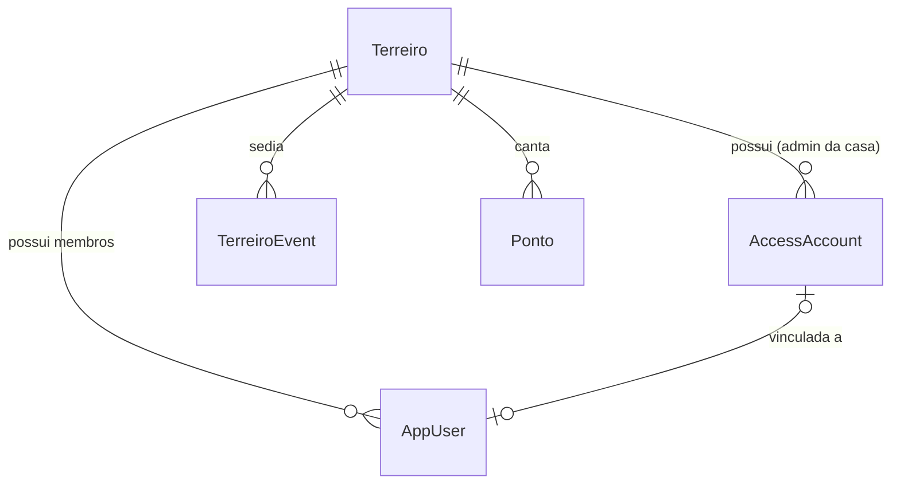

# Guia de Negócio e Engenharia (Frontend para Backend) — Ilê WebApp

Este documento serve como referência técnica e mapa de regras de negócio para o desenvolvedor backend. Ele descreve a arquitetura atual do frontend (que simula um banco de dados e autenticação local), os modelos de dados, as abas do aplicativo e a lógica de negócios que precisa ser portada para a API e o banco de dados definitivo.

---

## 1. Visão Geral da Arquitetura Atual

Atualmente, o **Ilê** é uma Single Page Application (SPA) construída em **React**, **TypeScript**, **Tailwind CSS** e **Framer Motion**.
Para fins de demonstração e funcionamento offline, toda a persistência de dados está estruturada no cliente:
*   **Dados da Aplicação (`AppData`)**: Armazenados no `localStorage` sob a chave `ile.app-data.v2`.
*   **Sessão de Autenticação (`AuthSession`)**: Armazenada no `localStorage` sob a chave `ile.auth-session.v1` contendo apenas o `accountId`.
*   **Camada de Dados (`AppDataContext.tsx`)**: Centraliza as operações de leitura e gravação (reduzir/despachar ações) e implementa em memória as regras de Controle de Acesso Baseado em Regras (RBAC).
*   **Simulação de Banco de Dados (`seed.ts`)**: Injeta dados fictícios (Casas/Terreiros, Contas administrativas, Usuários membros, Eventos e Pontos de cantiga) que são mesclados aos dados salvos no `localStorage` a cada carregamento para garantir que a interface sempre tenha conteúdo inicial consistente.

---

## 2. Modelos de Dados (Entidades)

Os modelos estão definidos em [src/types/index.ts](file:///c:/Users/Pedro/Desktop/ile-webapp/src/types/index.ts). O backend deve estruturar suas tabelas/coleções seguindo essa mesma lógica de relacionamentos.



### A. Terreiro (Casas de Culto)
Representa cada terreiro individual cadastrado no ecossistema do aplicativo.
```typescript
interface Terreiro {
  id: string;               // ID gerado no front (ex: T1234 ou UUID no back)
  nome: string;             // Nome do Terreiro
  cidade: string;           // Cidade do Terreiro
  estado: string;           // Estado (2 letras, ex: BA)
  dirigente: string;        // Nome do Zelador/Pai/Mãe de Santo
  contato: string;          // Telefone/WhatsApp
  observacoes: string;      // Notas adicionais sobre a casa
  ativo: boolean;           // Indica se a casa está ativa no sistema
  accessAccountId: string;  // Conta de acesso administrativo principal vinculada a este Terreiro
  createdAt: string;        // Timestamp ISO
}
```

### B. AccessAccount (Contas de Acesso / Credenciais)
Gerencia as credenciais de login e as regras de controle de acesso (escopo e nível de permissão).
```typescript
interface AccessAccount {
  id: string;               // ID da conta
  nome: string;             // Nome de exibição
  email: string;            // E-mail de login (único)
  password: string;         // Senha criptografada (atualmente plain text no front)
  scope: 'global' | 'terreiro'; // Escopo de atuação
  role: 'global_admin' | 'terreiro_admin' | 'terreiro_user'; // Papel de acesso
  terreiroId: string;       // ID do terreiro (vazio se scope for 'global')
  userId: string | null;    // ID do usuário físico (membro) vinculado (ou null se for conta puramente administrativa)
  createdAt: string;
}
```

### C. AppUser (Membros / Pessoas)
Representa as pessoas físicas vinculadas a um Terreiro.
```typescript
interface AppUser {
  id: string;               // ID do usuário
  nome: string;             // Nome completo
  email: string;            // E-mail para contato
  telefone: string;         // Telefone/WhatsApp
  role: 'administrador' | 'dirigente' | 'membro' | 'visitante'; // Função ritualística na casa
  status: 'ativo' | 'inativo'; // Status operacional do membro
  terreiroId: string;       // Terreiro ao qual pertence (vazio se for Hub Geral)
  accessAccountId: string | null; // Conta de login vinculada a este membro
  createdAt: string;
}
```

### D. TerreiroEvent (Agenda / Eventos)
Eventos marcados por cada Terreiro na agenda litúrgica.
```typescript
interface TerreiroEvent {
  id: string;
  date: Date;               // Objeto Date no front (salvo como string ISO)
  title: string;            // Título (ex: 'Gira de Caboclo')
  time: string;             // Horário (ex: '19:00')
  location: string;         // Local de realização
  type: 'normal' | 'importante'; // Prioridade/Tipo de evento
  category: 'Religioso' | 'Festa' | 'Manutenção' | 'Fundamento' | 'Estudo' | 'Administrativo';
  terreiroId: string;       // ID do terreiro que criou o evento
  description: string;      // Detalhes do ritual ou mutirão
  createdAt: string;
}
```

### E. Ponto (Cantigas / Pontos Cantados)
Banco de dados de cantigas sagradas por terreiro.
```typescript
interface Ponto {
  id: string;
  titulo: string;           // Título da cantiga
  categoria: 'ORIXÁS' | 'CABOCLOS' | 'PRETOS VELHOS' | 'EXUS' | 'ERÊS' | 'BOIADEIROS' | 'OUTROS';
  youtubeUrl: string;       // Link de referência do YouTube
  descricao: string;        // Descrição do ponto
  thumbnail: string;        // Miniatura do YouTube gerada a partir da URL
  terreiroId: string;       // ID do terreiro dono do ponto
  letra: string;            // Letra escrita da cantiga
  createdAt: string;
}
```

---

## 3. Lógica de Controle de Acesso (RBAC)

O backend precisará implementar um Middleware de Autorização rigoroso para filtrar as consultas (`GET`) e bloquear as mutações (`POST/PUT/DELETE`) de acordo com a conta logada. As regras implementadas hoje no `AppDataContext` são:

### A. Escopos e Papéis de Acesso (`AccessRole` & `AuthScope`)
*   **Global Admin (`role: global_admin`, `scope: global`)**:
    *   Possui controle total sobre o ecossistema.
    *   É o **único** que pode criar, editar ou excluir Terreiros.
    *   Pode visualizar, editar e excluir qualquer conta de acesso, usuário ou evento de qualquer casa.
*   **Terreiro Admin (`role: terreiro_admin`, `scope: terreiro`)**:
    *   Administrador específico de um Terreiro (geralmente o Dirigente/Pai de Santo da casa).
    *   Pode criar, editar e excluir contas de acesso, usuários e eventos **apenas** se pertencerem ao mesmo `terreiroId` da sua conta.
    *   Não pode criar/editar terreiros, nem alterar dados de outras casas.
*   **Terreiro User (`role: terreiro_user`, `scope: terreiro`)**:
    *   Membro comum de um Terreiro específico.
    *   Visualiza apenas os eventos, pontos e dados cadastrados para o seu `terreiroId`.
    *   Não tem acesso à aba **Cadastros** (Painel Admin) nem a ações de escrita.
*   **Hub User (`role: terreiro_user` com `terreiroId: ""` vazio, `scope: global`)**:
    *   Um usuário que se cadastrou sem fornecer o código de um terreiro. Ele entra no **Hub Geral** como visitante global.
    *   Visualiza todos os terreiros cadastrados, além dos eventos e pontos públicos de todas as casas.
    *   Não possui privilégios de escrita e vê um fluxo de tela diferenciado (`HubView`).

### B. Regras Específicas de Escopo (Consultas do Banco)
Ao carregar dados do banco de dados, o backend deve filtrar os resultados com base no token do usuário:
```python
# Pseudo-código de filtragem no backend para o banco de dados
def get_events(current_user):
    if current_user.role == 'global_admin' or current_user.is_hub_user:
        return db.events.find() # Todos os eventos
    else:
        return db.events.find(terreiroId=current_user.terreiroId) # Apenas do seu terreiro
```
Essa mesma lógica de isolamento por `terreiroId` aplica-se a **Usuários**, **Eventos** e **Pontos de Cantiga**.

---

## 4. Fluxos de Tela e Lógica das Abas

O aplicativo renderiza visualizações dinâmicas dependendo do estado de autenticação e do tipo de conta logada.

### A. Tela de Login e Cadastro (`LoginView.tsx`)
Apresenta um carrosel em tela cheia com imagens ambientadas (Oxalá, Oxum, Iemanjá, etc.). Possui três sub-fluxos:
1.  **Login Comum**:
    *   O usuário insere e-mail e senha.
    *   O sistema busca a credencial correspondente.
    *   *Regra do Tema T7CA*: Se o e-mail inserido começar com "t7ca", "rodrigo" ou "ana", o aplicativo detecta em tempo real (`isT7CA` fica `true`) e muda dinamicamente o gradiente do card do formulário de dourado/creme para tons de **Azul Sagrado** e inclui o brasão do T7CA no título.
    *   *Acesso de Teste*: Um botão flutuante expõe atalhos rápidos para preencher credenciais de teste (Admin Geral, Admin do T7CA, Usuário comum do T7CA, e Usuário do Hub Geral).
2.  **Cadastro de Membro**:
    *   Campos: Nome, Sobrenome, E-mail, Celular, Senha, Confirmação e **Código do Terreiro (Opcional)**.
    *   *Regra de Negócio*: Se o usuário digitar um código válido de terreiro (ex: `T1234` ou o nome parcial de uma casa existente), sua conta é gerada vinculada àquele terreiro (`scope: 'terreiro'`, `role: 'terreiro_user'`, `terreiroId: matchedId`). Se deixar o código em branco, ele é criado como usuário global no **Hub Geral** (`scope: 'global'`, `role: 'terreiro_user'`, `terreiroId: ""`).
3.  **Cadastro de Terreiro**:
    *   Fluxo dividido em 2 Passos para menor carga cognitiva:
        *   *Passo 1 (Detalhes do Terreiro)*: Nome do Terreiro, Celular, Cidade, Estado, Dirigente Responsável.
        *   *Passo 2 (Acesso do Administrador)*: E-mail administrativo, Senha e Confirmação.
    *   *Regra de Negócio*: Ao finalizar, o sistema cria o **Terreiro** gerando um código de convite único composto pela letra `T` seguida de 4 dígitos numéricos aleatórios (ex: `T4891`), e cria a **Conta de Acesso** administrativa associada como `terreiro_admin`. O código de convite gerado é retornado em um alerta na tela para que o dirigente distribua aos membros.

---

### B. Tela Principal do Terreiro (`HomeView.tsx`)
Renderizada para usuários logados pertencentes a um terreiro específico.
*   **Banner Superior**: Exibe um slideshow com imagens místicas da natureza e rituais que mudam a cada 3,5 segundos, com efeito translúcido (Aurora Glow) ao fundo.
*   **Mensagem de Boas-Vindas Generificada**: O front executa uma regra simples de gênero (`isFemale`) analisando a terminação do primeiro nome da conta logada (terminados em "a" ou contendo "ana", "maria", "beatriz", "julia" etc.). Exibe `"Seja muito bem vinda!"` ou `"Seja muito bem-vindo!"`. *Nota: No backend definitivo, recomenda-se salvar o campo de gênero ou pronome diretamente no perfil do usuário.*
*   **Card de Próxima Atividade**: Busca nos eventos daquela casa o próximo evento agendado cuja data seja igual ou posterior à data atual (organizado de forma cronológica ascendente). Exibe a data no formato de folhinha de calendário ("Ticket Apple style") e a categoria do evento. Clicar no card redireciona para a aba de Eventos.
*   **Atalhos Rápidos**: Botões arredondados em formato de pílula para navegar para **Calendário**, **Financeiro** (Tela "Em Breve") e **Divindades**.

---

### C. Tela do Hub Geral (`HubView.tsx`)
Renderizada **apenas** quando o usuário logado possui perfil de visitante global (`terreiroId: ""`). Funciona como um portal de descoberta de Terreiros.
*   **Stories (Estilo Instagram)**:
    *   Exibe um feed horizontal com bolhas contendo o avatar de terreiros que postaram atividades recentes.
    *   Ao clicar em um Story, abre um modal em tela cheia que avança automaticamente a cada 5 segundos através de uma barra de progresso (ou avança ao tocar no canto direito e retrocede ao tocar no canto esquerdo). Pressionar o story pausa o progresso.
    *   O story exibe o nome do terreiro, título da atividade, imagem do ritual e uma breve descrição operacional.
*   **Busca e Listagem de Casas**:
    *   Barra de busca em tempo real que filtra os Terreiros por nome, cidade ou estado.
    *   Ao selecionar um Terreiro da lista, abre uma tela de detalhamento da casa contendo as abas:
        *   *Início*: Informações gerais (Dirigente, Contato com link direto para WhatsApp, Endereço simulado, Observações).
        *   *Eventos*: Lista filtrada de eventos futuros e passados daquela casa.
        *   *Pontos*: Lista de cantigas daquele terreiro com player embutido do YouTube.

---

### D. Calendário de Eventos (`EventsView.tsx`)
Aba de visualização e agendamento de eventos do terreiro ativo.
*   **Calendário Interativo**: Desenvolvido com `react-calendar`, renderiza um ponto azul (`.dot bg-[#1565c0]`) nas datas que possuem eventos registrados para a casa correspondente.
*   **Lista de Atividades do Dia**: Abaixo do calendário, exibe todos os rituais, reuniões ou manutenções agendadas para o dia selecionado no calendário, ordenados por hora.
*   **Criação de Eventos**:
    *   Apenas usuários com papel `isTerreiroAdmin` (Dirigentes ou Administradores da casa) visualizam o botão de adicionar (`+`).
    *   Ao clicar, abre um modal inferior (BottomSheet) para preenchimento: Título do Evento, Horário, Local, Categoria, Tipo (Normal ou Importante) e Descrição. O evento é registrado para a data que estava selecionada no calendário.

---

### E. Enciclopédia de Orixás (`DivindadesView.tsx`)
Dicionário informativo de divindades do panteão afro-brasileiro (Orixás), aberto a todos os usuários.
*   **Lista Bento Grid**: Grid de duas colunas com cards minimalistas contendo a foto e o elemento correspondente de cada Orixá.
*   **Modal de Detalhes Estilizado**:
    *   Ao selecionar uma divindade, abre uma tela com transição vertical suave.
    *   *Sparks Particle Effect*: Um script de animação em lote (`SparksEffect`) gera dinamicamente 14 partículas de faíscas que sobem verticalmente da base da imagem de capa, utilizando a cor específica de destaque da divindade.
    *   *Informações Litúrgicas*: Exibe Saudação, Elemento, Sincretismo católico, Dia da semana, Cores rituais, Símbolos e História.
    *   *Vídeo Incorporado*: Um contêiner com `aspect-video` renderiza um player oficial de vídeo (YouTube) contendo documentários ou cantigas de referência da divindade (utiliza IDs estáticos configurados por divindade).

---

### F. Painel Administrativo de Cadastros (`CadastrosView.tsx`)
Visível apenas para administradores (`isTerreiroAdmin`). É o módulo crítico de estruturação de dados.
*   **Abas de Controle**: Alterna entre as tabelas de **Terreiros**, **Usuários** e **Eventos**.
*   **Gestão de Terreiros** (Exclusivo para `global_admin`):
    *   Criação e edição de novas casas e de sua conta master associada.
    *   *Regra de Exclusão*: Um terreiro não pode ser removido se possuir usuários ou eventos associados no sistema. Deve haver sempre ao menos 1 terreiro cadastrado.
*   **Gestão de Usuários**:
    *   Permite a criação e edição de membros da casa.
    *   *Lógica de Sincronização*: Ao criar um usuário na tabela de membros (`AppUser`), o formulário exige o cadastro paralelo de suas credenciais de login (`AccessAccount`). Ambas as tabelas são gravadas de forma atômica conectando `userId` e `accessAccountId`.
    *   *Regra de Exclusão*: Um administrador logado não pode remover o próprio acesso do sistema.
*   **Gestão de Eventos**:
    *   Permite visualizar em formato de tabela operacional todos os eventos do terreiro, com botões para Editar (abre modal com dados pré-carregados) e Excluir.

---

## 5. Diretrizes para o Desenvolvimento do Backend

Para portar o sistema com sucesso, o backend deve arquitetar os seguintes recursos:

1.  **Autenticação Robusta (JWT)**:
    *   Substituir a busca linear no `localStorage` por uma rota `/api/auth/login` que valide o e-mail e confira a senha usando criptografia (`bcrypt` ou similar).
    *   Retornar um JWT contendo no payload as informações cruciais de segurança: `accountId`, `role`, `scope` e `terreiroId`.
2.  **Isolamento de Dados Multitenant (Terreiro como Tenant)**:
    *   Todas as consultas às coleções/tabelas de `users`, `events` e `pontos` devem, obrigatoriamente, incluir um filtro onde `terreiroId` seja igual ao `terreiroId` extraído do JWT do usuário solicitante.
    *   Apenas administradores globais (`global_admin`) podem fazer requisições sem o filtro de `terreiroId`.
3.  **Segurança nas Rotas de Escrita (Mutações)**:
    *   A rota de cadastro de terreiro (`/api/terreiros/register`) e deleção deve validar se quem assina a requisição é um `global_admin`.
    *   As rotas `/api/users` e `/api/events` devem possuir um middleware que impeça a criação de registros cujo `terreiroId` enviado no corpo seja diferente do `terreiroId` do token de quem está criando (a menos que seja um admin geral).
4.  **Sistema de Convites**:
    *   O código de convite (ex: `T4891`) gerado na criação do terreiro deve ser armazenado em banco.
    *   A rota de cadastro de usuários comuns deve receber esse código opcional, validar se o terreiro existe e vincular o novo usuário ao ID correspondente da casa.
5.  **Stories Operacionais**:
    *   Implementar tabelas/coleções para armazenar publicações temporárias dos Terreiros (ex: expirando em 24h ou armazenando histórico permanente com flags de exibição).
