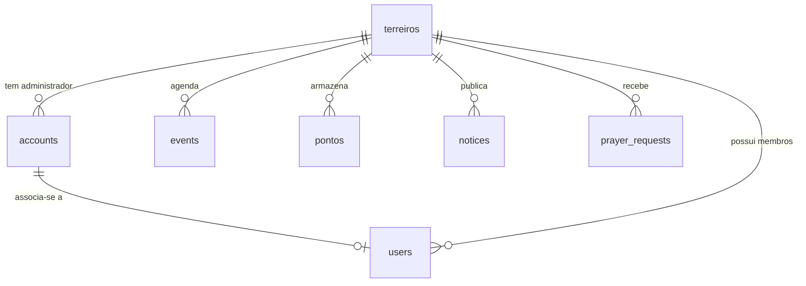

# Ilê - Documentação Backend

---

> [!WARNING]
> ### 🛠️ Nota (Estado Atual do Projeto)
>
> 1. **Segurança e Validação no Banco**: O banco de dados **não** possui regras rígidas de segurança (RLS - Row Level Security), critérios de verificação ou restrições complexas de acesso aplicadas nas tabelas, pois estamos em fase inicial de desenvolvimento.
> 2. **Confirmação de E-mail**: Realizamos testes de confirmação de e-mail no fluxo de cadastro (`signUp`), porém desativamos/suspendemos essa obrigatoriedade nas configurações do Supabase para acelerar os testes de desenvolvimento.
> 3. **Regras de Negócio**: O app ainda não tem regras de negócio definitivas ou consolidadas. Quase tudo no código e nas tabelas é experimental. Contudo, **nada é mockado** nas operações principais: todas as telas realizam operações reais de CRUD diretamente integradas e validadas no banco de dados.
> 4. **Interface e UI/UX**: O foco atual está na estruturação da ideia, modelagem do banco e no funcionamento das integrações. A UI/UX e o polimento visual não foram a prioridade principal nesta etapa.

---

## 🛠️ Stack Tecnológica

- **Frontend**: React (Vite) + TypeScript
- **Estilização & Transições**: Tailwind CSS + Framer Motion (animações de transição)
- **Banco de Dados & Autenticação**: Supabase (utilizando `@supabase/supabase-js` no cliente)

---

## 🔑 Níveis de Acesso (Roles)

O controle de visualização e permissões baseia-se na coluna `role` da tabela `public.accounts`:

1. **`global_admin`**: Administrador geral do sistema. Tem acesso total a todos os terreiros, contas, membros, eventos e pontos do banco.
2. **`terreiro_admin`**: Dirigente/Administrador de um terreiro específico. Gerencia dados apenas do seu terreiro (`terreiro_id`), esses são os chamados Pais, fazendo alusão a pai de santo do terreiro (ou mãe se for mulher).
3. **`terreiro_user`**:
   - **Com `terreiro_id`**: Membro (ou filho) ativo de um terreiro. Visualiza a `HomeView` do seu terreiro, seus eventos, avisos, pontos e suas próprias solicitações de oração.
   - **Sem `terreiro_id` (Hub User)**: Usuário que se cadastrou sem código de convite. É redirecionado para a `HubView` (portal geral de terreiros e comércio).

---

## 📺 Páginas e Fluxos (Views)

As telas do app são renderizadas condicionalmente no [App.tsx](file:///src/App.tsx) com base no estado `currentView`:

* **`LoginView`**: Tela de autenticação e registro. Permite login usando e-mail ou username. O cadastro possui dois fluxos distintos:
  - **Membro**: Solicita dados pessoais e um código opcional do terreiro.
  - **Terreiro**: Registra simultaneamente um novo terreiro e cria a conta do seu administrador (`terreiro_admin`).
* **`HomeView`**: Dashboard principal do membro vinculado a um terreiro. Exibe infos da casa, próximos eventos e atalhos rápidos.
* **`HubView`**: Exibido para usuários `terreiro_user` não vinculados a nenhum terreiro. Permite buscar terreiros cadastrados e ver prévias públicas de eventos/pontos.
* **`EventsView`**: Agenda e cronograma de giras, festas e reuniões. Permite CRUD completo para administradores do terreiro.
* **`PontosView`**: Acervo de pontos cantados. Possui busca por categoria, exibição de letras, player de vídeo do YouTube integrado e tela de cadastro/edição de pontos.
* **`OracaoView`**: Cadastro de pedidos de oração (Saúde, Caminhos, etc.).
  - Membros normais criam pedidos e visualizam apenas o seu histórico.
  - Administradores visualizam todos os pedidos do terreiro e podem marcá-los como respondidos/atendidos.
* **`AvisosView`**: Mural de comunicados do terreiro. Admins podem criar e remover avisos organizados por prioridade.
* **`CadastrosView`**: Painel administrativo acessível apenas para perfis admin. Permite gerenciar:
  - **Terreiros** (Somente `global_admin`)
  - **Contas de Acesso** (`public.accounts`)
  - **Membros/Usuários** (`public.users`)
* **`DivindadesView`**: Guia informativo de Orixás com dados estáticos, saudações, sincretismos e vídeos do YouTube.

---

## 💾 Modelagem do Banco (Supabase)

### Autenticação & Trigger Principal
Quando um usuário se cadastra no Supabase Auth (`auth.users`), a trigger PostgreSQL `on_auth_user_created` intercepta o evento e executa a função `public.handle_new_user()`, inserindo automaticamente uma linha na tabela `public.accounts` com os metadados do usuário (`raw_user_meta_data`).

### Tabelas (`public`)



1. **`terreiros`** (Entidade do Terreiro)
   - `id` (text, PK): Identificador único (geralmente gerado como código ex: `T1234`).
   - `nome` (text, NOT NULL), `cidade` (text), `estado` (text), `dirigente` (text), `contato` (text), `observacoes` (text).
   - `ativo` (boolean): Status de funcionamento.
   - `access_account_id` (uuid): Conta administradora vinculada.

2. **`accounts`** (Perfis de Login associados ao `auth.users`)
   - `id` (uuid, PK): ID correspondente ao `auth.users.id`.
   - `nome` (text), `email` (text), `username` (text, UNIQUE).
   - `scope` (text): Nível de escopo (`global` ou `terreiro`).
   - `role` (text): Permissão (`global_admin`, `terreiro_admin`, `terreiro_user`).
   - `terreiro_id` (text): FK para `terreiros.id`.
   - `user_id` (text): FK opcional apontando para `users.id`.

3. **`users`** (Cadastro físico de membros no terreiro)
   - `id` (text, PK): ID único gerado no frontend (`user_membro_...`).
   - `nome` (text, NOT NULL), `email` (text), `telefone` (text).
   - `role` (text): Papel espiritual/administrativo (membro, administrador, etc.).
   - `status` (text): Status do membro (`ativo`, `inativo`).
   - `terreiro_id` (text): FK de vinculação ao terreiro.
   - `access_account_id` (uuid): FK opcional vinculando à conta de login (`accounts.id`).

4. **`events`** (Agenda de Atividades)
   - `id` (text, PK), `date` (date, NOT NULL), `title` (text, NOT NULL), `time` (text), `location` (text).
   - `type` (text): Prioridade (`normal`, `importante`).
   - `category` (text): Categoria do evento (Religioso, Festa, Manutenção, etc.).
   - `description` (text), `terreiro_id` (text, NOT NULL).

5. **`pontos`** (Biblioteca de Pontos Cantados)
   - `id` (text, PK), `titulo` (text, NOT NULL), `categoria` (text), `youtube_url` (text), `letra` (text), `descricao` (text), `thumbnail` (text).
   - `terreiro_id` (text, NOT NULL).

6. **`notices`** (Mural de Avisos)
   - `id` (text, PK), `title` (text, NOT NULL), `content` (text, NOT NULL).
   - `category` (text): Tipo de aviso (`Importante`, `Programação`, `Geral`).
   - `date` (timestamp with time zone), `terreiro_id` (text, NOT NULL).

7. **`prayer_requests`** (Pedidos de Oração)
   - `id` (text, PK), `name` (text, NOT NULL), `type` (text, NOT NULL), `content` (text, NOT NULL).
   - `answered` (boolean, DEFAULT false), `answered_at` (timestamp with time zone).
   - `account_id` (text, NOT NULL), `terreiro_id` (text, NOT NULL).

---

## 🚀 Como Executar o Banco Localmente / Seed

Caso precise resetar as tabelas locais ou migrar a estrutura com dados de teste, execute:

```bash
node scripts/setup_db.cjs
node scripts/create_notices_table.cjs
node scripts/create_prayers_table.cjs
```

Esses scripts criam as tabelas, criam a trigger de contas (`handle_new_user`), limpam dados antigos de teste e inserem os seguintes usuários iniciais para desenvolvimento:

- **Admin Geral**: `admin@ile.app` / `123456`
- **Admin Terreiro (Erick)**: `erick@t7ca.app` / `123456`
- **Membro Terreiro**: `membro@t7ca.app` / `123456`
